# 📈 Live Status: <!--live status--> **🟩 All systems operational**

This repository contains the open-source uptime monitor for nexvelsolutions, powered by [Upptime](https://github.com/upptime/upptime).

With [Upptime](https://upptime.js.org), you can get your own unlimited and free uptime monitor, powered entirely by a GitHub repository. We use [Issues](https://github.com/nexvelsolutions/nexvel-upptime/issues) as incident reports and [Actions](https://github.com/nexvelsolutions/nexvel-upptime/actions) as uptime monitors.

<!--start: status pages-->
<!-- This summary is generated by Upptime (https://github.com/upptime/upptime) -->
<!-- Do not edit this manually, your changes will be overwritten -->
<!-- prettier-ignore -->
| URL | Status | History | Response Time | Uptime |
| --- | ------ | ------- | ------------- | ------ |
|  [Angel](https://www.angelhvac.com/) | 🟩 Up | [angel.yml](https://github.com/nexvelsolutions/nexvel-upptime/commits/HEAD/history/angel.yml) | 

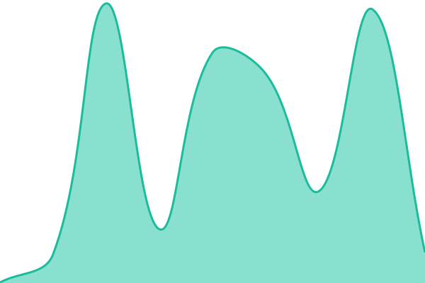 265ms
     
 | 

<a href="https://nexvelsolutions.github.io/nexvel-upptime/history/angel">99.98%</a>
    

|  [Appliance Doctor](https://sickappliance.com/) | 🟩 Up | [appliance-doctor.yml](https://github.com/nexvelsolutions/nexvel-upptime/commits/HEAD/history/appliance-doctor.yml) | 

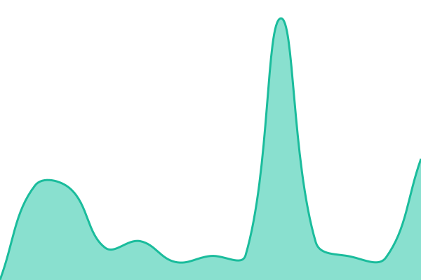 303ms
     
 | 

<a href="https://nexvelsolutions.github.io/nexvel-upptime/history/appliance-doctor">100.00%</a>
    

|  [Bill Frusco](https://www.billfrusco.com/) | 🟩 Up | [bill-frusco.yml](https://github.com/nexvelsolutions/nexvel-upptime/commits/HEAD/history/bill-frusco.yml) | 

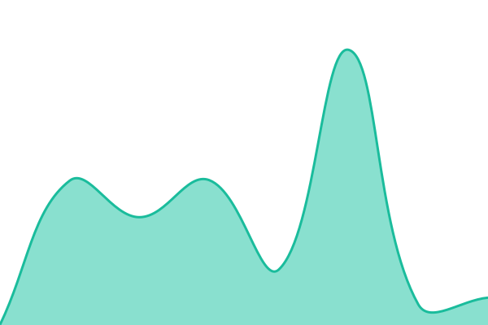 277ms
     
 | 

<a href="https://nexvelsolutions.github.io/nexvel-upptime/history/bill-frusco">100.00%</a>
    

|  [Boss Plumbing & Heating](https://bossplumbingheating.com/) | 🟩 Up | [boss-plumbing-and-heating.yml](https://github.com/nexvelsolutions/nexvel-upptime/commits/HEAD/history/boss-plumbing-and-heating.yml) | 

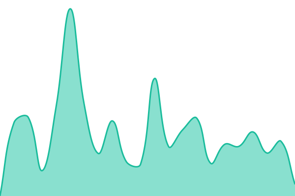 225ms
     
 | 

<a href="https://nexvelsolutions.github.io/nexvel-upptime/history/boss-plumbing-and-heating">100.00%</a>
    

|  [Cooper](https://gmcooper.com/) | 🟩 Up | [cooper.yml](https://github.com/nexvelsolutions/nexvel-upptime/commits/HEAD/history/cooper.yml) | 

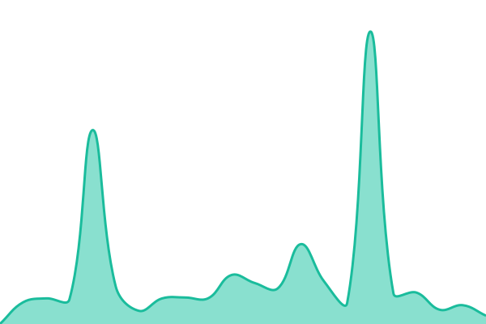 989ms
     
 | 

<a href="https://nexvelsolutions.github.io/nexvel-upptime/history/cooper">99.95%</a>
    

|  [DiBello](https://www.phildibelloroofing.com/) | 🟩 Up | [di-bello.yml](https://github.com/nexvelsolutions/nexvel-upptime/commits/HEAD/history/di-bello.yml) | 

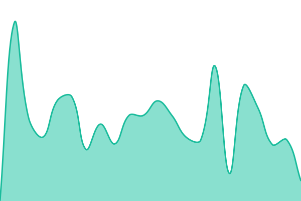 255ms
     
 | 

<a href="https://nexvelsolutions.github.io/nexvel-upptime/history/di-bello">100.00%</a>
    

|  [Dr. Levin](https://www.aperiodoc.com/) | 🟩 Up | [dr-levin.yml](https://github.com/nexvelsolutions/nexvel-upptime/commits/HEAD/history/dr-levin.yml) | 

 2123ms
     
 | 

<a href="https://nexvelsolutions.github.io/nexvel-upptime/history/dr-levin">100.00%</a>
    

|  [Fresh Air Flow](https://freshairflowhvac.com/) | 🟩 Up | [fresh-air-flow.yml](https://github.com/nexvelsolutions/nexvel-upptime/commits/HEAD/history/fresh-air-flow.yml) | 

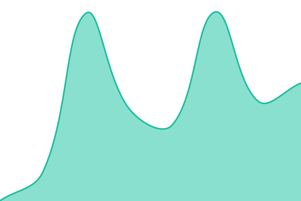 241ms
     
 | 

<a href="https://nexvelsolutions.github.io/nexvel-upptime/history/fresh-air-flow">100.00%</a>
    

|  [Garrison Roofing](https://wearegarrisonroofing.com/) | 🟩 Up | [garrison-roofing.yml](https://github.com/nexvelsolutions/nexvel-upptime/commits/HEAD/history/garrison-roofing.yml) | 

 349ms
     
 | 

<a href="https://nexvelsolutions.github.io/nexvel-upptime/history/garrison-roofing">100.00%</a>
    

|  [Goodman Plumbers](https://www.goodmanplumbers.com/) | 🟩 Up | [goodman-plumbers.yml](https://github.com/nexvelsolutions/nexvel-upptime/commits/HEAD/history/goodman-plumbers.yml) | 

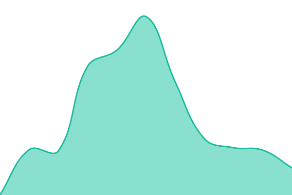 398ms
     
 | 

<a href="https://nexvelsolutions.github.io/nexvel-upptime/history/goodman-plumbers">100.00%</a>
    

|  [Greate Works Plumbing](https://gworksplumbing.com/) | 🟩 Up | [greate-works-plumbing.yml](https://github.com/nexvelsolutions/nexvel-upptime/commits/HEAD/history/greate-works-plumbing.yml) | 

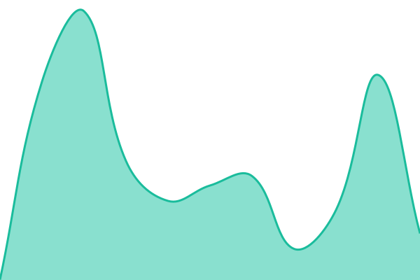 320ms
     
 | 

<a href="https://nexvelsolutions.github.io/nexvel-upptime/history/greate-works-plumbing">100.00%</a>
    

|  [Highpoint Dental](https://www.highpointdental.com/) | 🟩 Up | [highpoint-dental.yml](https://github.com/nexvelsolutions/nexvel-upptime/commits/HEAD/history/highpoint-dental.yml) | 

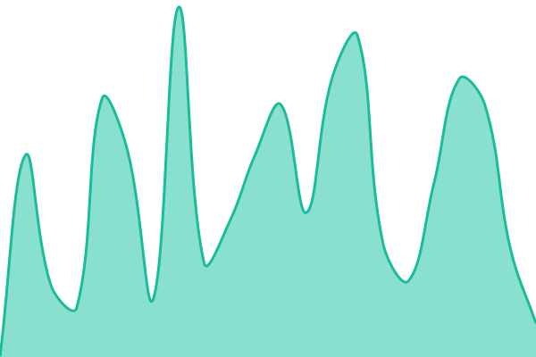 352ms
     
 | 

<a href="https://nexvelsolutions.github.io/nexvel-upptime/history/highpoint-dental">100.00%</a>
    

|  [Himmelstein](https://www.louisbhimmelsteinlaw.com/) | 🟩 Up | [himmelstein.yml](https://github.com/nexvelsolutions/nexvel-upptime/commits/HEAD/history/himmelstein.yml) | 

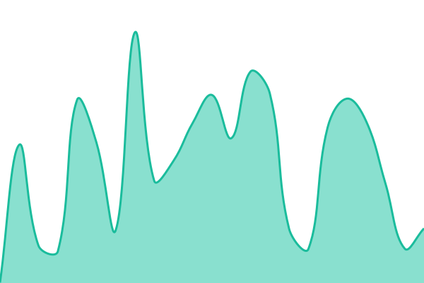 314ms
     
 | 

<a href="https://nexvelsolutions.github.io/nexvel-upptime/history/himmelstein">100.00%</a>
    

|  [Hirschberg](https://hirschbergmechanical.com/) | 🟩 Up | [hirschberg.yml](https://github.com/nexvelsolutions/nexvel-upptime/commits/HEAD/history/hirschberg.yml) | 

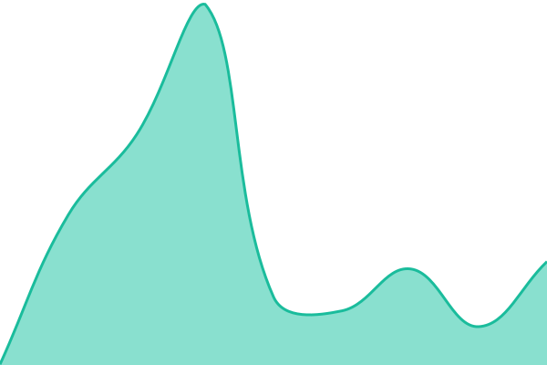 186ms
     
 | 

<a href="https://nexvelsolutions.github.io/nexvel-upptime/history/hirschberg">100.00%</a>
    

|  [J&J](https://jjtransportation.com/) | 🟩 Up | [j-and-j.yml](https://github.com/nexvelsolutions/nexvel-upptime/commits/HEAD/history/j-and-j.yml) | 

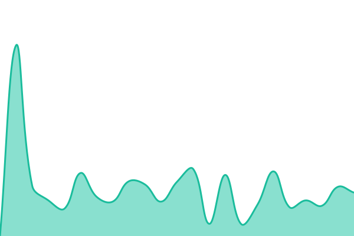 289ms
     
 | 

<a href="https://nexvelsolutions.github.io/nexvel-upptime/history/j-and-j">100.00%</a>
    

|  [Jenkintown Endo](https://jenkintownendo.com/) | 🟩 Up | [jenkintown-endo.yml](https://github.com/nexvelsolutions/nexvel-upptime/commits/HEAD/history/jenkintown-endo.yml) | 

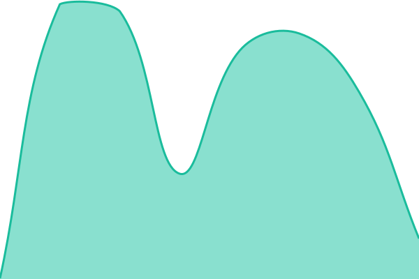 214ms
     
 | 

<a href="https://nexvelsolutions.github.io/nexvel-upptime/history/jenkintown-endo">100.00%</a>
    

|  [MMK](https://www.mmklawfirm.com/) | 🟩 Up | [mmk.yml](https://github.com/nexvelsolutions/nexvel-upptime/commits/HEAD/history/mmk.yml) | 

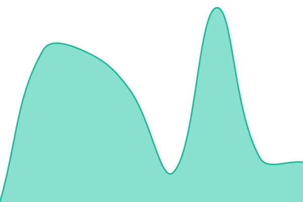 413ms
     
 | 

<a href="https://nexvelsolutions.github.io/nexvel-upptime/history/mmk">100.00%</a>
    

|  [Philadelphia Quality Roofing](https://philadelphiaqualityroofing.com/) | 🟩 Up | [philadelphia-quality-roofing.yml](https://github.com/nexvelsolutions/nexvel-upptime/commits/HEAD/history/philadelphia-quality-roofing.yml) | 

 274ms
     
 | 

<a href="https://nexvelsolutions.github.io/nexvel-upptime/history/philadelphia-quality-roofing">100.00%</a>
    

|  [Randy Kaplan](https://www.randykaplanlaw.com/) | 🟩 Up | [randy-kaplan.yml](https://github.com/nexvelsolutions/nexvel-upptime/commits/HEAD/history/randy-kaplan.yml) | 

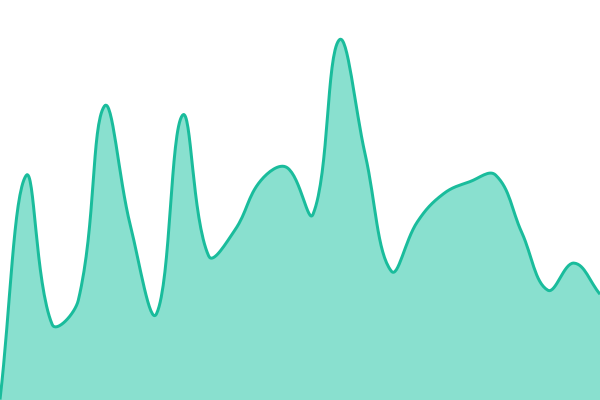 422ms
     
 | 

<a href="https://nexvelsolutions.github.io/nexvel-upptime/history/randy-kaplan">100.00%</a>
    

|  [Reliable](https://reliableplumbinganddraincleaning.com/) | 🟩 Up | [reliable.yml](https://github.com/nexvelsolutions/nexvel-upptime/commits/HEAD/history/reliable.yml) | 

 310ms
     
 | 

<a href="https://nexvelsolutions.github.io/nexvel-upptime/history/reliable">100.00%</a>
    

|  [SD](https://www.sdaccounting.com/) | 🟩 Up | [sd.yml](https://github.com/nexvelsolutions/nexvel-upptime/commits/HEAD/history/sd.yml) | 

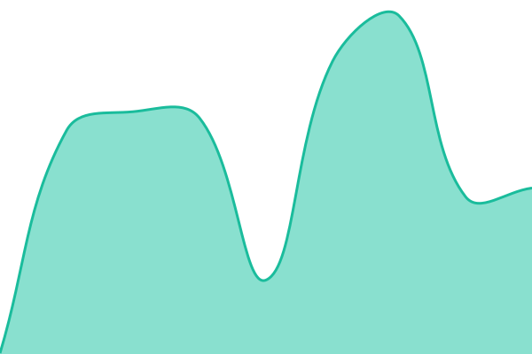 349ms
     
 | 

<a href="https://nexvelsolutions.github.io/nexvel-upptime/history/sd">100.00%</a>
    

|  [State Road](https://www.stateroadsupply.com/) | 🟩 Up | [state-road.yml](https://github.com/nexvelsolutions/nexvel-upptime/commits/HEAD/history/state-road.yml) | 

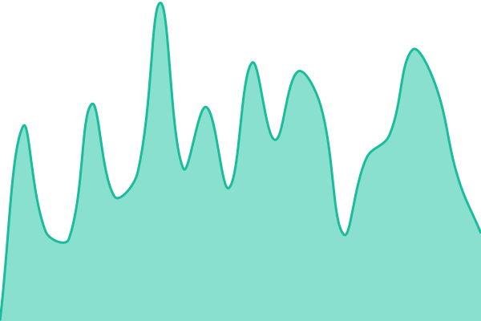 487ms
     
 | 

<a href="https://nexvelsolutions.github.io/nexvel-upptime/history/state-road">100.00%</a>
    

|  [Surrey Strathmore](https://surreystrathmorewp.com/) | 🟩 Up | [surrey-strathmore.yml](https://github.com/nexvelsolutions/nexvel-upptime/commits/HEAD/history/surrey-strathmore.yml) | 

 281ms
     
 | 

<a href="https://nexvelsolutions.github.io/nexvel-upptime/history/surrey-strathmore">100.00%</a>
    

|  [Zakian](https://www.zakianrugs.com/) | 🟩 Up | [zakian.yml](https://github.com/nexvelsolutions/nexvel-upptime/commits/HEAD/history/zakian.yml) | 

 2506ms
     
 | 

<a href="https://nexvelsolutions.github.io/nexvel-upptime/history/zakian">100.00%</a>
    

<!--end: status pages-->

## 📄 License

- Powered by: [Upptime](https://github.com/upptime/upptime)
- Code: [MIT](./LICENSE) © [Anand Chowdhary](https://anandchowdhary.com)
- Data in the `./history` directory: [Open Database License](https://opendatacommons.org/licenses/odbl/1-0/)
